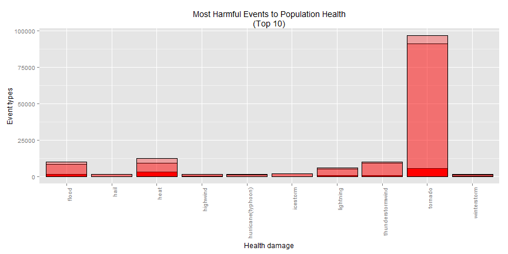
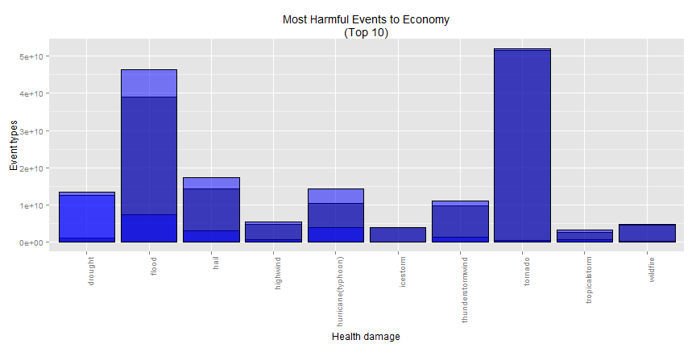

## NOAA Storm Database Analysis regarding Economy and Health Damages
#### Tianxiang(Ivan) Liu
#### 16/08/2014

### Synopsis
Storms and other severe weather events can cause both public health and economic problems for communities and municipalities. Many severe events can result in fatalities, injuries, and property damage, and preventing such outcomes to the extent possible is a key concern.

This analysis is mainly to address the questions including: 
    
    1. Across the United States, which types of events are most harmful with respect to population health? 
    
    2. Across the United States, which types of events have the greatest economic consequences? 

Main steps including data processing, data cleansing, plotting and resulting.

### Data processing
Download datasets and load into R

```r
setwd(choose.dir())
data.url <- "https://d396qusza40orc.cloudfront.net/repdata%2Fdata%2FStormData.csv.bz2"
data.csv <- "repdata-data-StormData.csv"
if(!(file.exists(data.csv)))
    download.file(data.url, destfile="repdata-data-StormData.csv")
system.time(noaa.data <- read.csv(data.csv,head=T))
```

```
##    user  system elapsed 
##  154.83    0.84  156.78
```

Dataset exploration - to get a summary re the datasets and allocate the variable names properly

```r
str(noaa.data)
```

```
## 'data.frame':	902297 obs. of  37 variables:
##  $ STATE__   : num  1 1 1 1 1 1 1 1 1 1 ...
##  $ BGN_DATE  : Factor w/ 16335 levels "1/1/1966 0:00:00",..: 6523 6523 4242 11116 2224 2224 2260 383 3980 3980 ...
##  $ BGN_TIME  : Factor w/ 3608 levels "00:00:00 AM",..: 272 287 2705 1683 2584 3186 242 1683 3186 3186 ...
##  $ TIME_ZONE : Factor w/ 22 levels "ADT","AKS","AST",..: 7 7 7 7 7 7 7 7 7 7 ...
##  $ COUNTY    : num  97 3 57 89 43 77 9 123 125 57 ...
##  $ COUNTYNAME: Factor w/ 29601 levels "","5NM E OF MACKINAC BRIDGE TO PRESQUE ISLE LT MI",..: 13513 1873 4598 10592 4372 10094 1973 23873 24418 4598 ...
##  $ STATE     : Factor w/ 72 levels "AK","AL","AM",..: 2 2 2 2 2 2 2 2 2 2 ...
##  $ EVTYPE    : Factor w/ 985 levels "   HIGH SURF ADVISORY",..: 834 834 834 834 834 834 834 834 834 834 ...
##  $ BGN_RANGE : num  0 0 0 0 0 0 0 0 0 0 ...
##  $ BGN_AZI   : Factor w/ 35 levels "","  N"," NW",..: 1 1 1 1 1 1 1 1 1 1 ...
##  $ BGN_LOCATI: Factor w/ 54429 levels "","- 1 N Albion",..: 1 1 1 1 1 1 1 1 1 1 ...
##  $ END_DATE  : Factor w/ 6663 levels "","1/1/1993 0:00:00",..: 1 1 1 1 1 1 1 1 1 1 ...
##  $ END_TIME  : Factor w/ 3647 levels ""," 0900CST",..: 1 1 1 1 1 1 1 1 1 1 ...
##  $ COUNTY_END: num  0 0 0 0 0 0 0 0 0 0 ...
##  $ COUNTYENDN: logi  NA NA NA NA NA NA ...
##  $ END_RANGE : num  0 0 0 0 0 0 0 0 0 0 ...
##  $ END_AZI   : Factor w/ 24 levels "","E","ENE","ESE",..: 1 1 1 1 1 1 1 1 1 1 ...
##  $ END_LOCATI: Factor w/ 34506 levels "","- .5 NNW",..: 1 1 1 1 1 1 1 1 1 1 ...
##  $ LENGTH    : num  14 2 0.1 0 0 1.5 1.5 0 3.3 2.3 ...
##  $ WIDTH     : num  100 150 123 100 150 177 33 33 100 100 ...
##  $ F         : int  3 2 2 2 2 2 2 1 3 3 ...
##  $ MAG       : num  0 0 0 0 0 0 0 0 0 0 ...
##  $ FATALITIES: num  0 0 0 0 0 0 0 0 1 0 ...
##  $ INJURIES  : num  15 0 2 2 2 6 1 0 14 0 ...
##  $ PROPDMG   : num  25 2.5 25 2.5 2.5 2.5 2.5 2.5 25 25 ...
##  $ PROPDMGEXP: Factor w/ 19 levels "","-","?","+",..: 17 17 17 17 17 17 17 17 17 17 ...
##  $ CROPDMG   : num  0 0 0 0 0 0 0 0 0 0 ...
##  $ CROPDMGEXP: Factor w/ 9 levels "","?","0","2",..: 1 1 1 1 1 1 1 1 1 1 ...
##  $ WFO       : Factor w/ 542 levels ""," CI","$AC",..: 1 1 1 1 1 1 1 1 1 1 ...
##  $ STATEOFFIC: Factor w/ 250 levels "","ALABAMA, Central",..: 1 1 1 1 1 1 1 1 1 1 ...
##  $ ZONENAMES : Factor w/ 25112 levels "","                                                                                                                               "| __truncated__,..: 1 1 1 1 1 1 1 1 1 1 ...
##  $ LATITUDE  : num  3040 3042 3340 3458 3412 ...
##  $ LONGITUDE : num  8812 8755 8742 8626 8642 ...
##  $ LATITUDE_E: num  3051 0 0 0 0 ...
##  $ LONGITUDE_: num  8806 0 0 0 0 ...
##  $ REMARKS   : Factor w/ 436781 levels "","-2 at Deer Park\n",..: 1 1 1 1 1 1 1 1 1 1 ...
##  $ REFNUM    : num  1 2 3 4 5 6 7 8 9 10 ...
```

```r
head(noaa.data,n=3)
```

```
##   STATE__          BGN_DATE
## 1       1 4/18/1950 0:00:00
## 2       1 4/18/1950 0:00:00
## 3       1 2/20/1951 0:00:00
##   BGN_TIME TIME_ZONE COUNTY
## 1     0130       CST     97
## 2     0145       CST      3
## 3     1600       CST     57
##   COUNTYNAME STATE  EVTYPE
## 1     MOBILE    AL TORNADO
## 2    BALDWIN    AL TORNADO
## 3    FAYETTE    AL TORNADO
##   BGN_RANGE BGN_AZI
## 1         0        
## 2         0        
## 3         0        
##   BGN_LOCATI END_DATE
## 1                    
## 2                    
## 3                    
##   END_TIME COUNTY_END
## 1                   0
## 2                   0
## 3                   0
##   COUNTYENDN END_RANGE
## 1         NA         0
## 2         NA         0
## 3         NA         0
##   END_AZI END_LOCATI LENGTH
## 1                      14.0
## 2                       2.0
## 3                       0.1
##   WIDTH F MAG FATALITIES
## 1   100 3   0          0
## 2   150 2   0          0
## 3   123 2   0          0
##   INJURIES PROPDMG PROPDMGEXP
## 1       15    25.0          K
## 2        0     2.5          K
## 3        2    25.0          K
##   CROPDMG CROPDMGEXP WFO
## 1       0               
## 2       0               
## 3       0               
##   STATEOFFIC ZONENAMES
## 1                     
## 2                     
## 3                     
##   LATITUDE LONGITUDE
## 1     3040      8812
## 2     3042      8755
## 3     3340      8742
##   LATITUDE_E LONGITUDE_
## 1       3051       8806
## 2          0          0
## 3          0          0
##   REMARKS REFNUM
## 1              1
## 2              2
## 3              3
```

```r
colnames(noaa.data)<-tolower(colnames(noaa.data))
```

Subset dataset based on analysis requirement - remove unnecessary variables in order to make dataset smaller and transfer damage figures to numbers with identical unit

```r
# first step subsetting
index.col <- c(1:2,7:8,21:28)
noaa.sub <- subset(noaa.data, select=index.col)
# calculate economic damage and health damage
noaa.sub$healthdmg <- noaa.sub$fatalities + noaa.sub$injuries
noaa.sub$cropmul[tolower(noaa.sub$cropdmgexp)=="k"]<-1000
noaa.sub$cropmul[tolower(noaa.sub$cropdmgexp)=="m"]<-1000000
noaa.sub$cropmul[is.na(noaa.sub$cropmul)] <- 1
noaa.sub$propmul[tolower(noaa.sub$propdmgexp)=="k"]<-1000
noaa.sub$propmul[tolower(noaa.sub$propdmgexp)=="m"]<-1000000
noaa.sub$propmul[is.na(noaa.sub$propmul)] <- 1
noaa.sub$cropdmg <- noaa.sub$cropdmg * noaa.sub$cropmul
noaa.sub$propdmg <- noaa.sub$propdmg * noaa.sub$propmul
noaa.sub$ecodmg <- noaa.sub$cropdmg + noaa.sub$propdmg
# second step subsetting
noaa.sub <- noaa.sub[,-c(1:3,5,6,10,12,14,15)]
```

Clean the inconsistencies in EVTYPE column - there is a significant percentage of event types are inconsistent such as "Avalanche" and "Avalanch", we need to indentify these errors and clean the data as much as possible. 
Data cleansing takes a lot of time and there are several steps in this section like first round cleasing and aggregation, second round cleasing and aggregation and mannual adjustments.

```r
event.types <- readLines("evtype.txt")
```

```
## Warning: incomplete final line found on 'evtype.txt'
```

```r
event.types <- as.factor(tolower(event.types))
noaa.sub$evtype2 <- as.factor(tolower(noaa.sub$evtype)) ## create new column for testing
spec_char <- c(" ","/","_",",",":","&","-")
for (i in 1:length(spec_char)){
    print(spec_char[i])
    event.types <- gsub(spec_char[i],"",as.character(event.types))
    noaa.sub$evtype2 <- gsub(spec_char[i],"",as.character(noaa.sub$evtype2))
}
```

```
## [1] " "
## [1] "/"
## [1] "_"
## [1] ","
## [1] ":"
## [1] "&"
## [1] "-"
```

```r
## Matching event types based on event.types
for (i in 1:length(event.types)){
    index <- grepl(pattern=event.types[i],x=noaa.sub$evtype2, fixed=F)
    noaa.sub$eventtype[index] <- event.types[i]
}
## First aggregate to make datasets smaller for the efficiency of following cleansing steps
noaa.sub$eventtype[is.na(noaa.sub$eventtype)] <- noaa.sub$evtype2[is.na(noaa.sub$eventtype)]
library(plyr)
noaa.agg <- ddply(noaa.sub, .(eventtype), summarize, propdmg=sum(propdmg),cropdmg=sum(cropdmg),
                  fatalities=sum(fatalities),injuries=sum(injuries),healthdmg=sum(healthdmg),
                  ecodmg=sum(ecodmg))
noaa.agg$sum <- noaa.agg[,6]+noaa.agg[,7]
noaa.agg <- noaa.agg[!(noaa.agg$sum==0),]
noaa.agg <- noaa.agg[,-8]
## Mannual data cleansing
adj <- matrix(c("tstm","thunderstormwind","thunder","thunderstormwind",
                "thuder","thunderstormwind","avalan","avalanche",
                "astronomical","astronomicallowtide","fog","freezingfog",
                "hurricane","hurricane(typhoon)","cold","coldwindchill",
                "torndao","tornado","thunerstormwinds","thunderstormwind",
                "thundeerstormwinds","thunderstormwind",
                "freeze","frost/freeze"), ncol=2,byrow = T)
for (i in 1:length(adj[,1])){
    for (j in 1:length(noaa.agg$eventtype)){
        if(grepl(adj[i,1],noaa.agg$eventtype[j],fixed=F))
            noaa.agg$eventtype[j] <- adj[i,2]
    }
}
noaa.agg <- ddply(noaa.agg, .(eventtype), summarize, propdmg=sum(propdmg),cropdmg=sum(cropdmg),
                  fatalities=sum(fatalities),injuries=sum(injuries),healthdmg=sum(healthdmg),
                  ecodmg=sum(ecodmg))
```

Sort and subset datasets for different analysis - only 10 largest items are subsetted into dataset

```r
noaa.health <- noaa.agg[,-c(2,3,7)]
noaa.eco <- noaa.agg[,-c(4,5,6)]
noaa.health <- head(arrange(noaa.health,desc(healthdmg)),n=10)
noaa.eco <- head(arrange(noaa.eco,desc(ecodmg)),n=10)
```

### Results
Health Plots and Results

```r
library(ggplot2)
g1 <- ggplot(noaa.health,aes(x=eventtype, y=fatalities))
g1 + geom_bar(stat="identity", fill="red",alpha=1, colour="black",) + 
labs(x="Health damage") + labs(y="Event types") + 
labs(title=paste("Most Harmful Events to Population Health", "(Top 10)", sep="\n"))+
theme(axis.text.x = element_text(angle = 90, hjust = 1)) + 
geom_bar(aes(x=eventtype, y=injuries),stat="identity",fill="red",alpha=0.3, colour="black") +
geom_bar(aes(x=eventtype, y=healthdmg),stat="identity",fill="red",alpha=0.3, colour="black")
```

 

Economy Plots and Results

```r
g2 <- ggplot(noaa.eco,aes(x=eventtype, y=propdmg))
g2 + geom_bar(stat="identity", fill="black",alpha=0.5, colour="black",) + 
labs(x="Health damage") + labs(y="Event types") + 
labs(title=paste("Most Harmful Events to Economy", "(Top 10)", sep="\n"))+
theme(axis.text.x = element_text(angle = 90, hjust = 1)) + 
geom_bar(aes(x=eventtype, y=cropdmg),stat="identity",fill="blue",alpha=0.5, colour="black") +
geom_bar(aes(x=eventtype, y=ecodmg),stat="identity",fill="blue",alpha=0.5, colour="black")    
```

 
